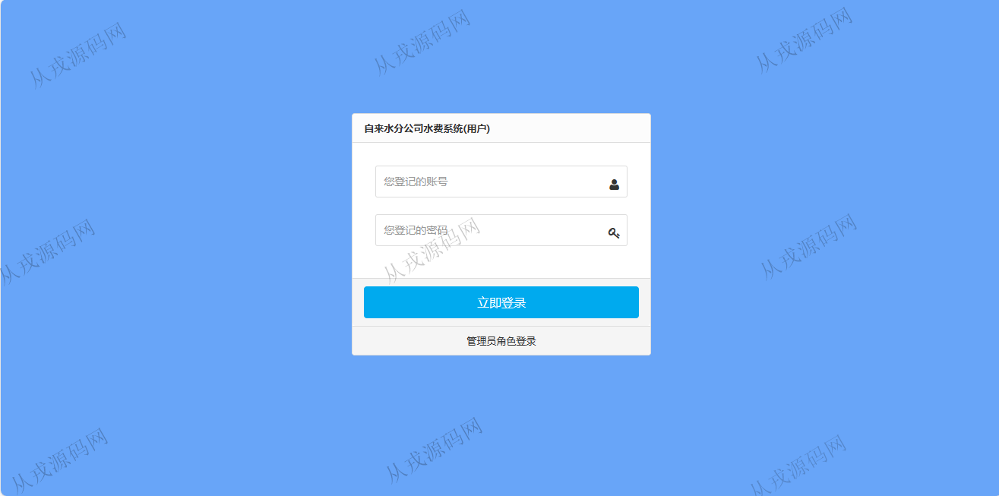
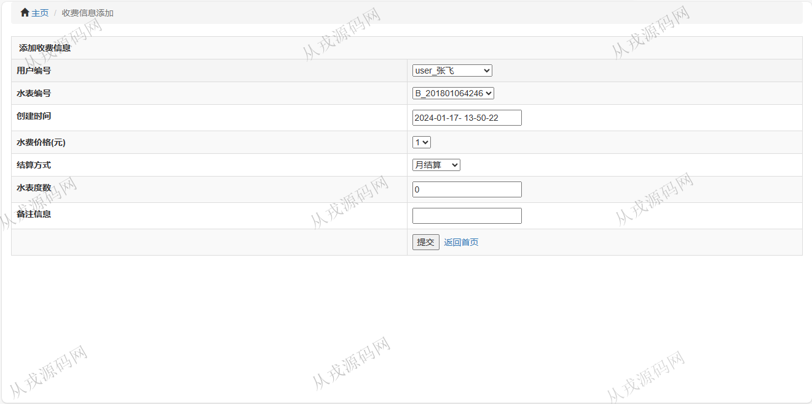
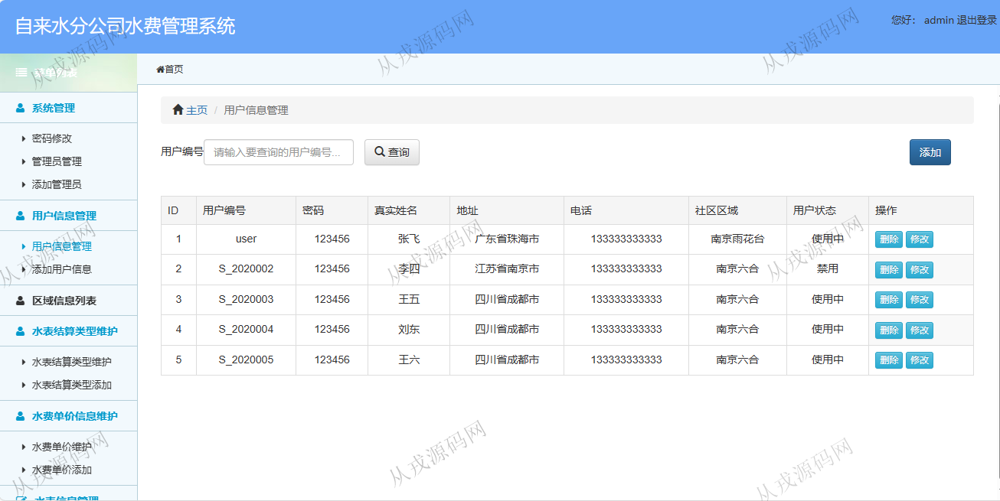
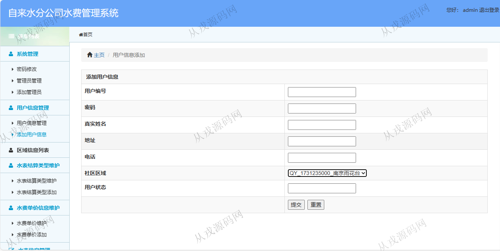
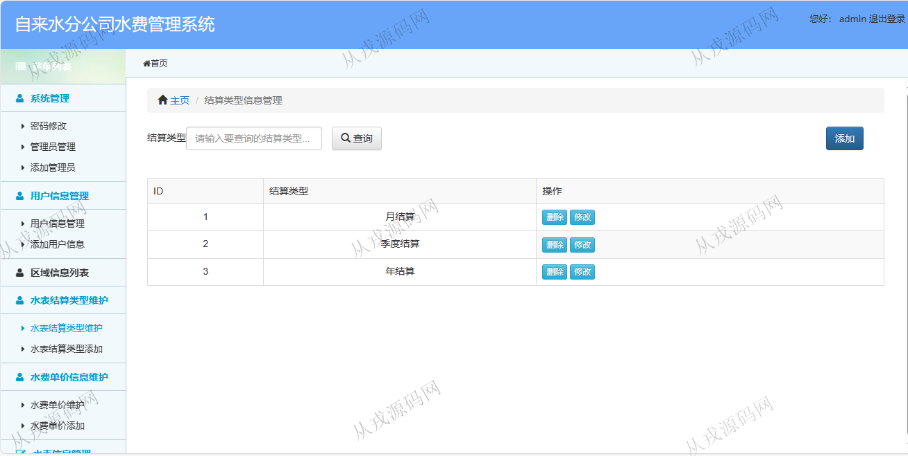
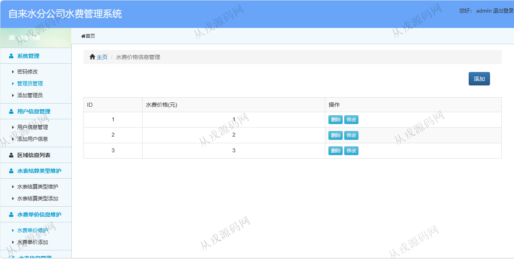
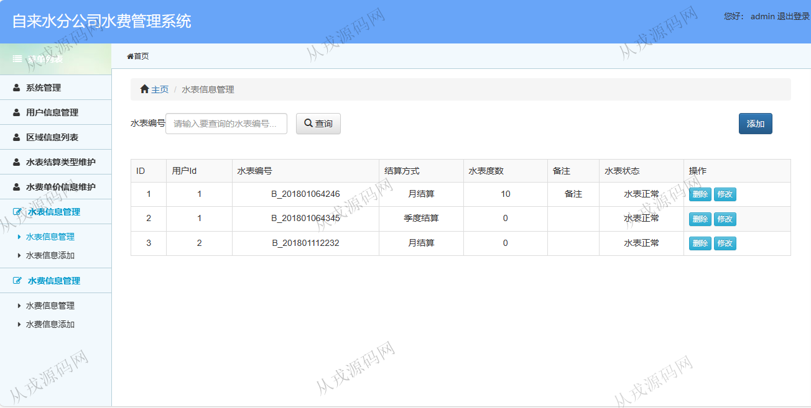
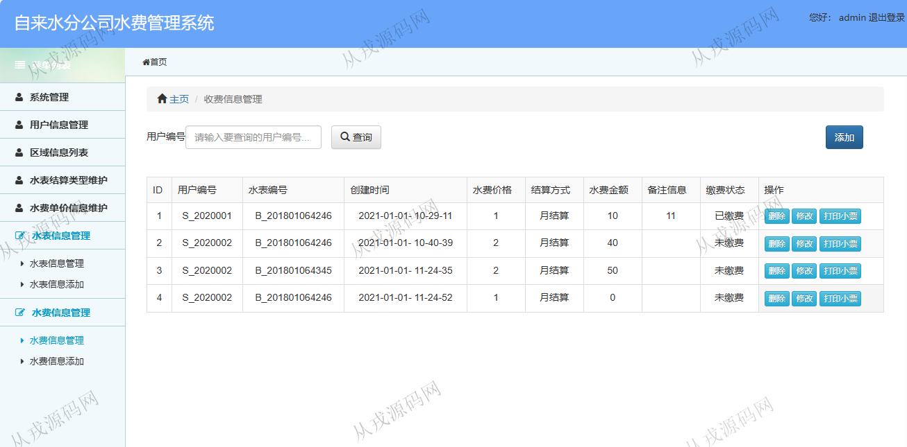
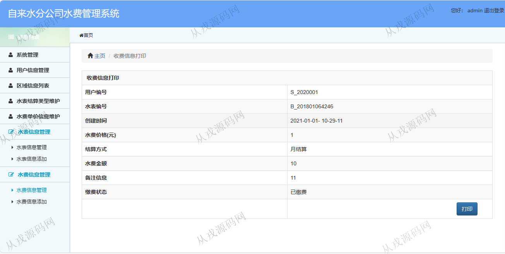

<h1 align="center">164.自来水分公司水费管理系统</h1>

 获取sql文件 QQ: 386869957 QQ群: 377586148 

 [更多源码项目: 从戎源码网](https://armycodes.com/) 

## 简介

> 本代码来源于网络,仅供学习参考使用!
>
> 提供1.远程部署/2.修改代码/3.设计文档指导/4.框架代码讲解等服务
> 
> 用户登录地址: http://localhost:8080/ssh_shuifei_sys/
> 
> 用户：user 123456
> 
> 管理员登录地址：http://localhost:8080/ssh_shuifei_sys/userlogin.jsp
> 
> 管理员：admin  123456
>

## 项目介绍
基于ssh的自来水分公司水费管理系统：前端 jsp、jquery，后端 struts、spring、hibernate；角色分为管理员、用户；集成水表信息、水费信息、水表结算类型等功能于一体的系统。

## 功能介绍

- 系统管理：密码修改，管理员信息的增删改查
- 用户管理：用户信息的增删改查，按用户编号搜索用户，用户密码修改
- 社区区域信息管理：社区区域信息的增删改查，按社区区域编号搜索信息
- 结算类型信息管理：类型信息的增删改查，按结算类型搜索
- 水费价格信息管理：水费价格信息的增删改查
- 水表信息管理：水表信息的增删改查，按水表编号搜索查询
- 水费信息管理：水费信息的增删改查，按用户编号搜索，打印小票

## 环境

- <b>IntelliJ IDEA 2021.3</b>

- <b>Mysql 5.7.26</b>

- <b>Tomcat 7.0.73</b>

- <b>JDK 1.8</b>

## 运行截图

